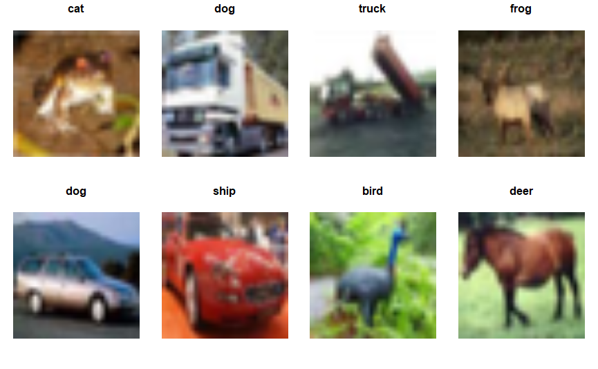

# Project 3: Weakly supervised learning -- label noise and correction



### [Full Project Description](doc/project3_desc.md)

Term: Spring 2022

+ Team: Group 5
+ Team members:
	+ [Marcus Loke](https://www.linkedin.com/in/lokemarcus/) (ml4636)
	+ [Sarah Kurihara](https://www.linkedin.com/in/sarahkurihara/) (sqk2003)
	+ [Shintaro Nakamura](https://www.linkedin.com/in/shintaro-nakamura/) (sn2904)
	+ [Yinan Shi](ys3387@columbia.edu) (ys3387)
	+ [Yixuan Zhang](yz4081@columbia.edu) (yz4081)

+ Project summary: Weakly supervised learning is a topic that addresses the issue of noisy and imperfect labels, much like the image above where many labels do not correspond correctly with the images. In this project, we created various models that performs image classification on a large dataset of 50,000 images with noisy labels. A baseline multinomial logistic regression model is created in the starter code and we developed two models that improves on that: Model 1 uses a convolutional neural network (CNN) that's trained on noisy labels while Model 2 employs a label correction network before training the same CNN on the cleaned labels.

+ Technologies used: Python and R (Keras/TensorFlow)
	
**Contribution statement**: ([default](doc/a_note_on_contributions.md)) All team members contributed equally in all stages of this project. All team members approve our work presented in this GitHub repository including this contributions statement. 

Following [suggestions](http://nicercode.github.io/blog/2013-04-05-projects/) by [RICH FITZJOHN](http://nicercode.github.io/about/#Team) (@richfitz). This folder is orgarnized as follows.

```
proj/
├── lib/
├── data/
├── doc/
├── figs/
└── output/
```

Please see each subfolder for a README file.
